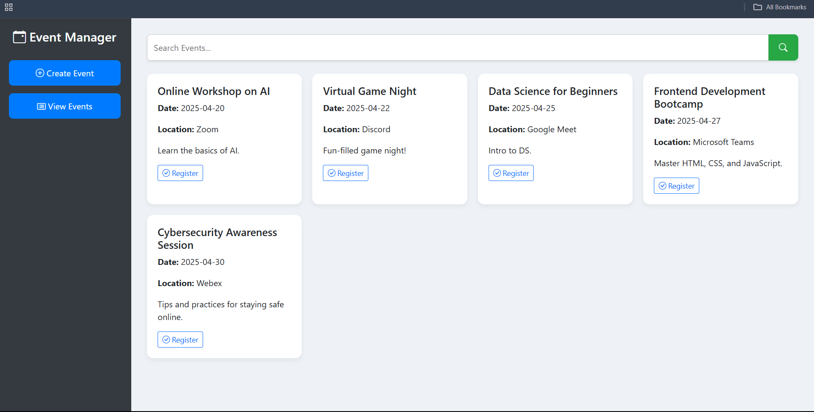

# 🗓️ Online Event Management System

This project is a **simple web-based application** for managing online events, allowing users to view events, register for them, and generate a QR code as a proof of registration. It is built using **HTML**, **CSS**, and **JavaScript** with **Bootstrap** for styling and layout.

---

## 🚀 Features

- 🖥️ Responsive dashboard layout using Bootstrap
- 📋 Dynamic event list section
- 📝 Registration form
- 🔐 Form validation
- 📇 QR code generation using `qrcodejs`
- 🌓 Simple dark-themed sidebar navigation

---

## 🛠️ Technologies Used

- HTML5
- CSS3
- JavaScript (Vanilla)
- Bootstrap 5
- [QRCode.js](https://davidshimjs.github.io/qrcodejs/) (for QR code generation)

---

## 📸 Screenshots

### 🔹 Dashboard View  

---

## 📌 How to Use

1. Clone or download the repository.
2. Open `index.html` in any modern web browser.
3. Click on **Register** in the sidebar.
4. Fill the form and click on **Generate QR**.
5. Your registration details and QR code will appear on the screen.

---

## ✅ Requirements

- A modern browser (Chrome, Firefox, Edge)
- No backend/server needed – works entirely in the browser

---

## 📦 External Libraries Used

- **Bootstrap 5**: For responsive design and components.
- **QRCode.js**: For generating QR codes based on form input.

---

## 📃 License

This project is open-source and free to use under the [MIT License](https://opensource.org/licenses/MIT).

---

## 🙌 Author

**Dinesh Shankar P**

---
